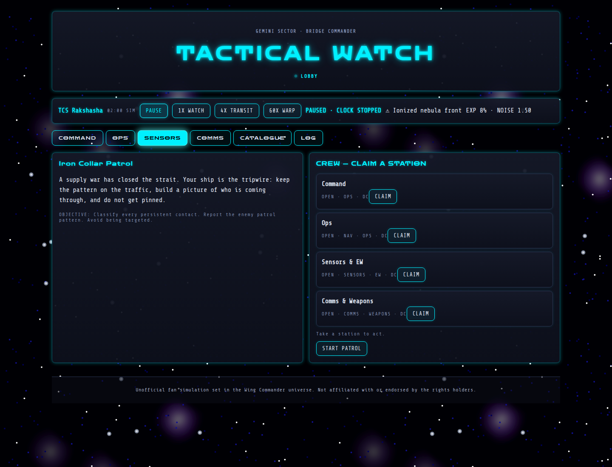

# Bridge Commander

Bridge Commander is the day-to-day work of a ship's Combat Information Center: long watches, incomplete returns, cautious maneuvering, and decisions made before anyone has a clean picture. The CIC is where a crew turns fragments—bearing, mass, heat, waveform, and silence—into enough certainty to keep the ship and its people alive.

On a capital ship, a torpedo hit or an antimatter-gun strike is not an abstract exchange of hit points. It can kill fifty to a hundred people in seconds, cripple a system, or start a chain of damage that the crew cannot stop. Capital-ship damage is serious, which is why the fighter paradigm reigns supreme in the Wing Commander universe: fighters are faster, harder to hit, easier to disperse, and can carry the fight away from the thousands of people living inside a ship of the line. The CIC's job is to give those fighters a useful picture—and to keep the capital ship from becoming a target in the first place.

## Preface

Ensign Parissa Nidaba had been staring at ice for forty-three minutes. The icefield filled half the tactical display, a vast tumble of frozen debris stretching across the stars. Comets, shattered moons, rocks and dust... all of it drifting silently through the dark. There was nothing interesting about it. That was precisely why she had been assigned to watch it.

She switched between passive listening, waveform analysis and the gravidar, building the sort of tedious contact picture nobody else on the bridge wanted to build. The Majestic was running quiet, her emissions deliberately suppressed. No active radar. Minimal communications. Engines restrained. Somewhere beneath the icefield, there might be something worth reporting. Probably there wasn't.

Then Parissa noticed something wrong with the reflections.

She magnified the passive return and compared it against the reflected starlight. The ice wasn't simply scattering the signal randomly. There was structure hidden inside the noise. She brought up the gravidar and began comparing mass arcs with the passive bearings. The answer came slowly, like an image developing in chemical film. The icefield was acting as a crude lens.

Parissa adjusted the filters again. Behind the ice, shapes emerged. Ships. Lots of them. Their active sensors were dark, but their existence betrayed them: faint drive-plume signatures, subtle heat noise, electromagnetic leakage, motion against the background, tiny disturbances in the reflected returns. She counted them once. Then again. A fleet. She turns to Nico Themistides. "Nico, can you confirm these reading?" She beams her console to his screen.

Confederation sensor technology was better than Kilrathi technology. Better receivers, better processing, better gravidar, better passive systems. But Parissa knew the other half of the equation. The Kilrathi had the edge in electronic and electromagnetic warfare. They were experts at hiding drive signatures, confusing sensors, creating false returns and turning certainty into suspicion. If she could see them through the ice, they might eventually figure out how to see her.

"CIC, Col. Taylor" Parissa said. Her voice sounded much smaller than she wanted. "Sensors. I have contacts." A pause. "How many?" "At least twenty. Possibly more. Kilrathi. They're behind the icefield." She hesitated before adding, "They're using it as cover."

The bridge came alive. CIC began correlating her data. Operations pulled up the tactical plot. Someone asked for a radar confirmation, and Parissa immediately shook her head. "No active radar. If they're dark, we don't tell them we're here just to get a better number." Her fingers kept working across the console, refining passive bearings and comparing the fleet's speed and signatures.

Then Operations began plotting a new course for the Majestic.

Parissa looked up. "Why are we moving?" The answer came from the comm officer, Lynn Murphy. "Because if you can see them, eventually they may be able to see us." Parissa looked back at the display. The Majestic had its own signature: heat bleeding into space, electromagnetic noise, engine emissions, motion detectable against the background. The ice could hide a ship, but it could not make that ship cease to exist.

The Majestic began turning, quietly and deliberately, while CIC scrambled a squadron into readiness. Parissa watched the Kilrathi fleet remain motionless beyond the icefield. For the moment, neither side had a firing solution. Neither knew exactly what the other had discovered. But as the Confederation cruiser slipped deeper into the darkness, Parissa realized that her boring little watch had become something else entirely. The fleet had been hiding from the Majestic. Now the Majestic was hiding from the fleet.

## User manual

Bridge Commander is a cooperative space-patrol game. The crew operates a ship from several bridge stations, builds a picture of nearby traffic, identifies contacts, manages exposure, and completes the patrol objective before an enemy gets a firing solution.

## Starting a patrol

*The lobby is where the crew reads the brief and claims a station before the watch begins.*

1. Open the game and wait for the room to connect.
2. In the lobby, claim an available station.
3. Read the campaign brief and objective on **Command**.
4. A player in Command, or the room host, selects **START PATROL**.

Each browser tab is a separate connection. To change stations, select **LEAVE SEAT**, then claim another open station.

## Stations

### Command

Reviews the campaign, readiness, exposure, patrol progress, rule of engagement, crew stations, and decision events. Command can start, pause, resume, or end the patrol. Pause before discussing an event or a dangerous contact.

### Operations

Controls the tactical plot and movement. Click the plot to place up to six waypoints; use **CLEAR COURSE** to remove them. The speed settings are **3 KPS** (cautious), **8 KPS** (cruise), and **FLANK** (maximum). **QUIET** reduces emissions; **CRUISE** is normal operation.

Speed costs battery and readiness and makes the ship easier to detect. Quiet running is slower but safer.

### Sensors & EW

Builds the contact picture with passive listening, active radar, gravidar, EM/motion sensing, waveform analysis, electronic warfare, and contact classification.

### Communications / Weapons

Sends transmissions and prepares firing solutions. Choose a contact in Sensors, select a weapon and shot type, then prepare or lock the solution. **STAND DOWN** makes all weapons safe.

## Time controls

- **PAUSE** stops movement, events, and cooldowns.
- **1X WATCH** runs one simulated minute per real minute.
- **4X TRANSIT** runs four simulated minutes per real minute.
- **60X WARP** runs sixty simulated minutes per real minute during uneventful transit.

Important events and terminal outcomes stop accelerated time.

## Sensors

Sensors run together; choosing one does not disable the others.

### Passive listening

Passive sensors are always on and do not broadcast your position. They provide bearing, emission clues, contact type clues, and a frequency waveform. Select a contact and use **LISTEN PASS** repeatedly to paint its signature. Compare it with the **SHIP DATABASE**; the database is a reference, not automatic truth.

### Active radar

**KEY RADAR** gives precise range and bearing, but broadcasts your position and raises exposure. **HIGH-POWER PING** gives a stronger reading, costs battery, and is more conspicuous. Use **STOW RADAR** when finished.

### Towed gravidar

Gravidar requires the ship to be moving. It detects mass arcs and provides a good bearing with approximate distance. Use **DEEP GRAV SWEEP** for a detailed scan; it does not identify a hull by itself.

### EM / motion

EM sensing estimates course and speed from a drive plume. Sun glare, nebulae, debris, dust, and other terrain can scramble it.

## Identification

Contacts remain anonymous (`TRACK-01`, etc.) until confirmed. Their states progress through **Unknown**, **Tracking**, **Probable**, **Classified**, and **Confirmed**.

After listening, the Sensors panel lists catalogue candidates from best match to worst. Use **TAG** to commit a classification. An incorrect call can damage the patrol. Combine waveform work with gravidar, radar, EM data, IFF, and—when available—a second bearing from a buoy.

Terrain can block or scatter returns. Ice can create a misleading reflected return, so do not trust a single clean-looking bearing.

## Buoys and noisemakers

Ops starts with two passive sensor buoys. Use **DEPLOY BUOY** to drop one at the ship's current position. It listens independently; a ship bearing plus a buoy bearing can triangulate a contact. Click a buoy on the Ops plot to recover it.

The ship also carries two noisemakers, or “crybabies.” Launch one when an enemy is building a track. It disrupts enemy lock accumulation for two turns, but also degrades your own passive and EM hearing. Use the cover to go quiet, change course, or make distance.

## Exposure, battery, readiness, and tension

- **Exposure** reflects how much attention the ship is attracting. Radar, speed, transmissions, and weapons preparation can raise it.
- **Battery** powers radar, high-power sweeps, and the noise filter. Active systems will not run below their minimum battery level.
- **Readiness** represents ship and crew condition. Hard running wears it down; quiet or stopped operations restore it.
- **Tension** rises with exposure, missed decisions, and escalation. Higher tension can bring additional hunters and events.

## Communications

Transmission modes trade reach for concealment:

- **TIGHT-BEAM** — lowest exposure and shortest practical reach.
- **BURST** — fast and more detectable.
- **OPEN** — broad reach with substantial exposure.
- **SPOOF** — deceptive traffic that may mislead an enemy but can raise suspicion.

## Weapons and firing solutions

| Weapon | Solution | Range | Requirement |
|---|---:|---:|---|
| Laser cannon | 0.20 | 12 klik | Close-range gun |
| Mass driver | 0.30 | 15 klik | Close kinetic weapon |
| Particle cannon | 0.45 | 18 klik | Settled track |
| Heat-seeking missile | 0.55 | 35 klik | Drive-plume track |
| Imaging missile | 0.70 | 45 klik | Confirmed hull |
| Anti-ship torpedo | 0.85 | 60 klik | Confirmed hull and strong track |

**QUICK SHOT** builds faster but has less margin and adds exposure. **REFINED SHOT** adds solution margin and is less exposing. Use **PREP SOLUTION** to prepare a mount and **LOCK SOLUTION** only when range, identification, track quality, and rules of engagement justify it.

Bridge Commander prepares a handoff; the actual engagement is resolved by the combat system.

## Decision events

Events appear in Command with a deadline and several choices. Read their hints carefully and resolve them before accelerating time. Expired events usually add tension or remove an opportunity. Events may affect exposure, tracks, communications, weapons, or the outcome.

## Winning and losing

Campaign objectives vary, but patrols generally reward one of these outcomes:

- **Endurance:** remain dark for six simulated hours without an enemy ever building a working track. Weapons must remain safe.
- **All tracked:** detect every hostile and bring each to at least Tracking while weapons remain safe. Correctly resolving waveforms and tagging contacts is the reliable route.
- **Disengagement:** every hostile clears 120 klik after at least one entered that range. This is a survival victory and does not require safe weapons.

You lose when a hostile lock reaches a firing solution on your ship. The watch ends immediately and the outcome is recorded in the log.

## Recommended first watch

1. Claim Ops or Sensors and assign Command.
2. Start quiet or cruise; avoid flank speed.
3. Listen passively to build the first contacts.
4. Keep radar stowed unless precision is necessary.
5. Use gravidar while making way.
6. Compare waveforms with the catalogue before tagging.
7. Deploy a buoy for difficult bearing-only contacts.
8. Keep weapons safe while a quiet victory remains possible.
9. Pause for decision events.
10. If enemy lock rises, go quiet, change course, deploy a noisemaker, and create distance.

The **CATALOGUE** contains ship reference profiles; **OPS** contains the plot and hazards; **LOG** contains the chronological record. When in doubt, pause and read the log before acting.
